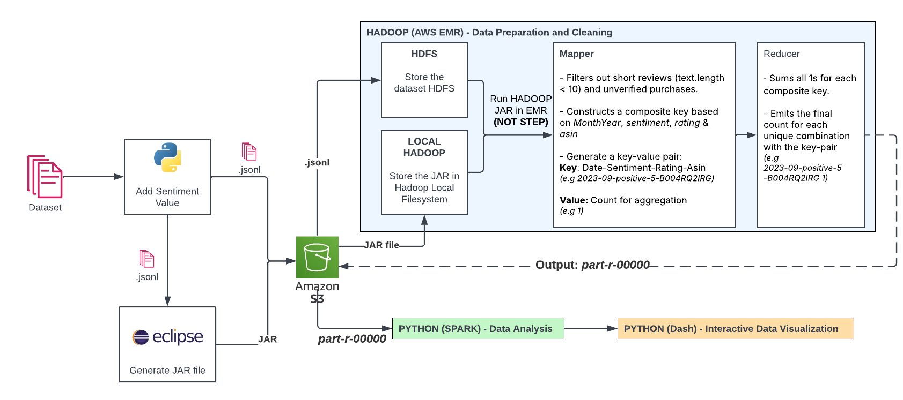

## Amazon Review Data Analysis: Video Games on Amazon

### **Dataset:**
We will be using the Amazon Reviews 2023 dataset, specifically focusing on the "Video Games" category.

### **Dataset Download Link:**
[Amazon Reviews 2023](https://amazon-reviews-2023.github.io/)

### **Project Goal:**
To leverage Hadoop and Spark for cleaning, processing, and performing data visualization on the Amazon Video Games review dataset to extract valuable insights about the gaming industry on Amazon.

### **Steps:**
1. **Dataset Acquisition:**
    * Navigate to the provided link.
    * Locate the "Video Games" category within the dataset.
    * Download the relevant dataset files (likely in Parquet or JSON format, depending on the available options).
    * So long the jsonl follows the same format as the one on amazon you can use it on other datsets.
2. **Data Preprocessing:**
    * Clean the data by removing any inconsistencies, null values, or duplicates.
    * Normalize the data to ensure consistency across different fields.
3. **Hadoop Setup**
    * Configure the Hadoop environment by setting up necessary configuration files (e.g., core-site.xml, hdfs-site.xml).
    * Upload the preprocessed dataset to the Hadoop Distributed File System (HDFS) as well the jar file that runs the Reducer, Driver and Mapper.
4. **Spark Setup:**
    * Configure the Hadoop environment by setting up necessary configuration files (e.g., core-site.xml, hdfs-site.xml).
    * Load the dataset from HDFS into a Spark DataFrame.
    * Perform data cleaning and transformation operations using Spark SQL/DataFrames.
    * Aggregate and analyze the data to extract meaningful insights (e.g., average rating, sentiment analysis).
5. **Machine Learning Analysis:**
    * Use the processed data to train machine learning models for various analyses (e.g., sentiment analysis, predictive modeling).
    * Implement the machine learning pipeline in a Jupyter Notebook (ml.ipynb).
    * Evaluate and refine the models to improve accuracy and performance.
6. **Data Visualization with Dash:**
    * Set up a Dash application to visualize the insights extracted from the dataset.
    * Create interactive visualizations (e.g., pie charts, line graphs, word clouds) to represent the data.
    * Implement callbacks in Dash to make the visualizations dynamic and responsive to user inputs.
### **Project Structure:**

#### **Java Folder:**
Contains Hadoop components:
- **Reducer.java** - Implements the reducer logic.
- **Driver.java** - Manages job configuration and execution.
- **Mapper.java** - Handles the mapping phase for data processing.

#### **Python Scripts:**
- **dash_app.py** - Runs the front end of the visualization (requires high RAM usage).
- **ml.ipynb** - Machine learning and analytical tasks.
- **sentiment.ipynb** - Runs the visualization and sentiment analysis.
- **spark_codes.py** - Runs the visualization on the EMR (Elastic MapReduce) cluster.

This project integrates Hadoop, Spark, and Dash for efficient processing and visualization of Amazon Video Game reviews.

